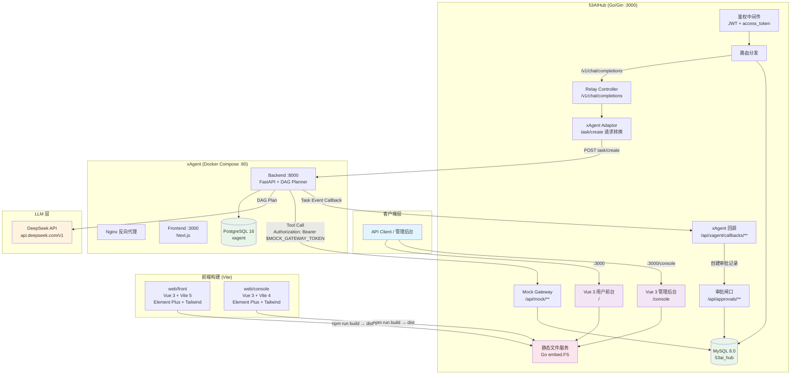

# AI Hub xAgent 集成部署文档

> 版本：v0.2.0 | 更新日期：2026-05-08
> 适用场景：开发/测试环境部署

---

## 1. 系统架构

```
客户端 (Web/API)
    │
    ├── :3000 ──► 53AIHub (Go/Gin) ──► MySQL 8.0 (:3306)
    │     │            │                  Redis 6 (:6379)
    │     │            │
    │     │   ┌────────┴──────────────────────┐
    │     │   │  静态文件服务 (Go embed.FS)     │
    │     │   │  ├── :3000/        → front/   │  用户前台 (Vue 3)
    │     │   │  └── :3000/console → console/ │  管理后台 (Vue 3)
    │     │   └───────────────────────────────┘
    │     │
    │     ├── POST /v1/chat/completions (OpenAI兼容)
    │     │       ↓
    │     ├── xAgent Adaptor ──► xAgent Backend (:80 via Nginx)
    │                  │       ↓                    │
    │                  │   task/create               ├── PostgreSQL
    │                  │       ↓                    │
    │                  │   DAG Plan → LLM (DeepSeek) │
    │                  │       ↓                    │
    │                  │   Tool Call ────────────► 53AIHub Mock Gateway
    │                  │       ↓                    ↑
    │                  │   Task Result ◄────────────┘
    │                  │       ↓
    │                  └── OpenAI Response → 客户端
    │
    └── Docker Compose ──► xAgent (Nginx + Frontend + Backend + PostgreSQL)
```

### 一图流架构



---

## 2. 环境要求

| 组件 | 版本 | 用途 |
| --- | --- | --- |
| Docker & Docker Compose | 20.10+ | xAgent + 53AIHub 容器编排 |
| Go | 1.21+ | 编译 53AIHub 后端 |
| Node.js | 18.12.0+ | 编译前端（用户前台 + 管理后台） |
| MySQL | 8.0 | 53AIHub 主数据库 |
| Python | 3.11+ | JWT 生成、加密工具、工具同步脚本 |
| Git | 2.x | 源码管理 |
| curl | 7.x | 部署验证 |

**Windows 开发环境路径参考**：

| 工具 | 路径 |
| --- | --- |
| Go SDK | `D:\Go\go\bin` |
| GOPATH | `C:\Users\zequan.lu\go` |
| Python | `C:\Users\zequan.lu\AppData\Local\Programs\Python\Python311` |
| MySQL (Docker) | `docker exec 53ai-hub-mysql-1 mysql` |

---

## 3. MySQL 数据库初始化

### 3.1 启动 MySQL 容器

```bash
docker run -d \
  --name 53ai-hub-mysql-1 \
  -p 3306:3306 \
  -e MYSQL_ROOT_PASSWORD=rootpassword \
  -e MYSQL_DATABASE=53ai_hub \
  -e MYSQL_USER=agent \
  -e MYSQL_PASSWORD=agentpassword \
  mysql:8.0 \
  --character-set-server=utf8mb4 \
  --collation-server=utf8mb4_unicode_ci
```

### 3.2 验证连接

```bash
docker exec 53ai-hub-mysql-1 mysql -u agent -pagentpassword -e "SELECT 1;"
```

---

## 4. xAgent 部署

### 4.1 获取源码

```bash
git clone <xagent-repo-url> /d/github/xagent
cd /d/github/xagent
```

### 4.2 配置环境变量

编辑 `.env` 文件（位于 xagent 根目录）：

```ini
# 数据库密码
POSTGRES_PASSWORD="xagent_password"

# Web 服务端口
PORT="80"

# DeepSeek API Key（必须配置，用于 LLM 方案生成）
DEEPSEEK_API_KEY="sk-your-deepseek-api-key"

# 加密密钥（数据库敏感字段加密，必须与 53AIHub DD 同步使用，生产环境需更换）
ENCRYPTION_KEY="<YOUR_FERNET_ENCRYPTION_KEY>"

# JWT 密钥
XAGENT_JWT_SECRET="replace-with-a-long-random-secret"
XAGENT_JWT_ALGORITHM="HS256"
XAGENT_ACCESS_TOKEN_EXPIRE_MINUTES="525600"

# Embedding API Key（可选，用于向量记忆）
DASHSCOPE_API_KEY="<YOUR_DASHSCOPE_API_KEY>"
```

> **注意**：`OPENAI_API_KEY` 留空或使用伪造值（`your-openai-api-key`），模型 API key 通过 xAgent 管理后台绑定到具体模型，见 4.4 节。

### 4.3 启动服务

```bash
docker compose up -d
```

等待所有容器就绪（约 60 秒）：

```bash
# 检查容器状态
docker compose ps

# 检查后端健康
curl -s http://localhost:80/health
# 预期输出: {"status":"healthy"}

# 检查前端
curl -s -o /dev/null -w "%{http_code}" http://localhost:80/
# 预期输出: 200
```

### 4.4 注册管理员账户

```bash
# 通过 xAgent API 注册管理员
curl -s -X POST http://localhost:80/api/auth/register \
  -H "Content-Type: application/json" \
  -d '{
    "username": "aihub2",
    "password": "aihub123456",
    "is_admin": true
  }'
```

记录返回的 `access_token`（JWT），后续所有 xAgent API 调用需要此 Token。

### 4.5 配置 LLM 模型

xAgent 需要通过管理后台配置 LLM 模型，但也可以直接操作 PostgreSQL：

```sql
-- 查看已有模型
docker exec xagent_postgres psql -U xagent -d xagent -c \
  "SELECT id, model_id, model_provider, model_name, base_url, is_active FROM models;"

-- 注册 DeepSeek 模型（如未自动创建）
INSERT INTO models (model_id, category, model_provider, model_name, base_url, is_active, _api_key_encrypted)
VALUES ('deepseek-chat', 'llm', 'openai', 'deepseek-chat', 'https://api.deepseek.com/v1', true,
        '<Fernet加密的API Key>');
```

> **Fernet 加密**：使用 `ENCRYPTION_KEY` 对 API Key 进行 Fernet 加密。
> ```python
> from cryptography.fernet import Fernet
> f = Fernet(b'<YOUR_FERNET_ENCRYPTION_KEY>')
> encrypted = f.encrypt(b'sk-your-deepseek-key').decode()
> print(encrypted)
> ```

### 4.6 绑定用户与模型

```sql
-- 授权用户使用模型（aihub2 user_id=3, model_id=1）
INSERT INTO user_models (user_id, model_id, is_owner, can_edit, can_delete, is_shared)
VALUES (3, 1, true, true, true, false);

-- 设置用户默认模型
INSERT INTO user_default_models (user_id, model_id, config_type)
VALUES (3, 1, 'general');
```

### 4.7 同步 53AIHub 工具到 xAgent

```bash
cd /d/github/xagent
python scripts/sync_aihub_tools.py
```

脚本将：
1. 调用 53AIHub Mock Gateway `/api/mock/capabilities` 获取工具清单
2. 为每个 Agent 创建 xAgent Custom API 记录
3. 配置工具 URL 为 `http://host.docker.internal:3000/api/mock/agents/{agent_no}/run`

### 4.8 创建 xAgent Agent Builder Agent

> **重要**：System Prompt 是决定输出质量的核心因素，**必须**使用完整的 L2/L3 输出质量约束 Prompt，不得使用简短版。
> 完整 Prompt 文本和维护规范见 `docs/AI Hub xAgent 系统提示词工程与输出质量保障方案.md` 第 4.1 节。

**推荐的 Agent 创建方式**（通过 xAgent 管理后台 UI）：

1. 登录 xAgent 管理后台 `http://localhost:80/`
2. 进入 **Agent Builder** → **Create Agent**
3. 填写以下字段：

| 字段 | 填写内容 | 说明 |
| --- | --- | --- |
| `name` | `53AIHub 全链路业务助手` | 清晰的业务描述 |
| `description` | `服务于职坐标教学/销售/教研/求职四大业务线的智能调度 Agent` | 简要说明 |
| `instructions` | **[完整 L2/L3 System Prompt](AI Hub xAgent 系统提示词工程与输出质量保障方案.md#41-agent-builder-主-system-prompt)** | 从配套文档复制完整内容 |
| `execution_mode` | `dag_plan_execute`（think 模式） | 复杂任务需要 DAG 规划 |

> **执行模式说明**：xAgent 内部 `flash` → `single_call`（单次调用）、`balanced` → `react`（ReAct 循环）、`think` → `dag_plan_execute`（DAG 规划执行）。本文档使用 53AIHub 统一术语 `think`，部署 API 传参时使用 xAgent 内部名称 `dag_plan_execute`。
| `models.general` | 选择 DeepSeek-V4（或其他强能力模型） | 输出质量对大模型能力要求高 |
| `tool_categories` | `["other"]` 或自定义分类 | 确保可访问全部 Custom API 工具 |
| `status` | `published` | 立即可用 |

**通过 API 创建**（备选方案）：

```bash
# 获取 JWT
XAGENT_TOKEN="<步骤4.4获取的token>"

# 创建 Agent（instructions 字段必须使用完整 L2/L3 Prompt）
# 完整 Prompt 过长，建议保存为文件后使用 @file 传参：
cat > /tmp/agent_instructions.md << 'PROMPT_EOF'
# 角色定义
你是 53AIHub 的智能业务助手...（完整内容见配套文档 4.1 节）
PROMPT_EOF

INSTRUCTIONS=$(cat /tmp/agent_instructions.md | python -c "import sys,json; print(json.dumps(sys.stdin.read()))")

curl -s -X POST http://localhost:80/api/agents \
  -H "Authorization: Bearer $XAGENT_TOKEN" \
  -H "Content-Type: application/json" \
  -d "{
    \"name\": \"53AIHub 全链路业务助手\",
    \"description\": \"服务于职坐标教学/销售/教研/求职四大业务线的智能调度 Agent\",
    \"instructions\": $INSTRUCTIONS,
    \"execution_mode\": \"dag_plan_execute\",
    \"models\": {\"general\": 1},
    \"tool_categories\": [\"other\"],
    \"status\": \"published\"
  }"
```

> 记录返回的 Agent ID（通常为 `1`）。
> **验证 Prompt 是否生效**：创建 Agent 后，通过 `GET /api/agents/{id}` 检查 `instructions` 字段长度是否 ≥ 2000 字符。

### 4.9 应用 CustomApiTool URL 补丁（重要）

xAgent 0.3.3-sync 的 Custom API Tool 不会自动从 DB 获取 URL/Method/Headers，需要手动修补容器内的文件：

```bash
# 进入容器
docker exec -it xagent_backend bash

# 编辑 /opt/venv/lib/python3.11/site-packages/xagent/web/tools/config.py
# 在 get_custom_api_configs() 的 dict 中添加 url、method、headers 字段

# 编辑 /opt/venv/lib/python3.11/site-packages/xagent/core/tools/adapters/vibe/api_tool_adapter.py
# 1. CustomApiToolArgs 中 url/method 改为 Optional，默认 None
# 2. CustomApiTool.__init__() 添加 url/method/headers 参数
# 3. run_json_async() 使用 self._default_url/_default_method/_default_headers
# 4. create_custom_api_tools() 传递 url/method/headers
```

> 详细补丁内容参考 `docs/AI Hub xAgent 集成开发对接计划.md` 第 6.3.9 节。

---

## 5. 前端构建与部署

53AIHub 包含两套前端项目，需要通过 Vite 构建后，将产物部署到后端 `api/static/` 目录。后端使用 Go 的 `embed.FS` 在编译时将前端静态文件嵌入二进制。

> **关键理解**：前端构建必须在后端编译之前完成，否则 Go embed 找不到文件，浏览器访问 `localhost:3000` 会报 500 错误。

### 5.1 前端项目结构

```
web/
├── front/      # 用户前台 (Vue 3 + Vite 5 + Element Plus + Tailwind CSS)
│   ├── .env                    # 环境变量（需配置 API 地址）
│   ├── vite.config.ts          # Vite 构建配置
│   ├── electron.vite.config.ts # Electron 桌面端构建配置（可选）
│   └── src/renderer/           # 源代码目录
│       └── main/
│           ├── router/         # 路由配置
│           ├── stores/         # Pinia 状态管理
│           └── api/            # Axios API 封装
└── console/   # 管理后台 (Vue 3 + Vite 4 + Element Plus + Tailwind CSS)
    ├── .env                    # 环境变量（需配置 API 地址）
    ├── vite.config.ts          # Vite 构建配置
    └── src/
        ├── router/             # 路由配置
        ├── stores/             # Pinia 状态管理
        └── api/                # Axios API 封装
```

### 5.2 配置前端环境变量

#### Front（用户前台）

编辑 `web/front/.env`：

```ini
# API 服务地址（必须配置）
VITE_GLOB_API_HOST=http://localhost:3000

# 管理后台地址
VITE_GLOB_ADMIN_URL=http://localhost:3000/console
```

> **说明**：`VITE_GLOB_API_HOST` 决定前端 Axios 请求的 `baseURL`。留空则自动使用 `window.location.origin`，适合前后端部署在同域名的场景。

#### Console（管理后台）

编辑 `web/console/.env`：

```ini
# 构建模式
VITE_PLATFORM=web

# 管理后台基础路径（对应 nginx 反向代理或 Go 路由前缀）
VITE_BASE_PATH=/console

# API 服务地址（留空=使用当前页面域名）
VITE_GLOB_API_HOST=
```

> **说明**：`VITE_BASE_PATH=/console` 确保静态资源路径都带 `/console` 前缀，与 Go 后端路由 `/console` 匹配。

### 5.3 构建管理后台（Console）

```bash
cd /d/Workspace/53AIHub/web/console

# 安装依赖
npm install

# 构建生产版本（输出到 dist/ 目录）
npm run build
```

> 构建产物在 `web/console/dist/`，包含 `index.html` 及 `static/js/`、`static/images/` 等资源。

### 5.4 构建用户前台（Front）

```bash
cd /d/Workspace/53AIHub/web/front

# 安装依赖
npm install

# 构建生产版本（输出到 out/renderer/ 目录）
npm run build
```

> 构建产物在 `web/front/out/renderer/`，包含 `index.html` 及 `assets/`、`images/` 等资源。

### 5.5 部署前端文件到后端

将两个前端项目的构建产物复制到 Go 后端的 static 目录：

```bash
# 复制管理后台
cp -r /d/Workspace/53AIHub/web/console/dist/* /d/Workspace/53AIHub/api/static/console/

# 复制用户前台
cp -r /d/Workspace/53AIHub/web/front/out/renderer/* /d/Workspace/53AIHub/api/static/front/
```

### 5.6 Docker 重建（针对 Docker 部署）

如果使用 Docker Compose 部署 53AIHub：

```bash
# 前端文件就位后，重新构建镜像
cd /d/Workspace/53AIHub/docker
docker compose build 53aihub

# 重启服务
docker compose up -d 53aihub
```

> **原理**：Dockerfile 中的 `COPY . .` 会将 `api/static/` 包含前端文件一起复制到容器，Go 编译时通过 `//go:embed all:static/front all:static/console` 嵌入二进制。

---

## 6. 53AIHub 部署

> **前提**：已完成 [5. 前端构建与部署](#5-前端构建与部署)，`api/static/` 中已包含前端文件。

### 6.1 获取源码

```bash
git clone <53aihub-repo-url> /d/Workspace/53AIHub
cd /d/Workspace/53AIHub
```

### 6.2 配置环境变量

复制并编辑 `api/.env`：

```bash
cp api/.env.example api/.env
```

关键配置项：

```ini
# 服务端口
PORT="3000"

# MySQL 连接串
SQL_DSN="agent:agentpassword@tcp(localhost:3306)/53ai_hub?charset=utf8mb4&parseTime=True&loc=UTC"

# === Mock Gateway 配置 ===
MOCK_GATEWAY_ENABLED="true"
MOCK_GATEWAY_TOKEN="mock-gateway-service-token-2026"
MOCK_GATEWAY_DEFAULT_SCENARIO="success"
MOCK_GATEWAY_DEFAULT_DELAY_MS="200"

# === xAgent 对接配置 ===
XAGENT_SERVICE_TOKEN="xagent-service-token-2026"
XAGENT_CALLBACK_TOKEN="xagent-callback-token-2026"
XAGENT_DEFAULT_EXECUTION_MODE="think"
XAGENT_MAX_STEPS="12"
XAGENT_TASK_TIMEOUT_SECONDS="600"

# === 网关基础 URL（xAgent 容器回访 53AIHub） ===
API_HOST="http://host.docker.internal:3000/"

# === 其他 ===
DEBUG="true"
LOG_LEVEL="INFO"
```

### 6.3 编译

```bash
# Windows (Git Bash)
export PATH="/d/Go/go/bin:$HOME/go/bin:$PATH"
cd /d/Workspace/53AIHub/api
GOARCH=amd64 CGO_ENABLED=0 go build -o ../build/53ai_hub.exe .
```

### 6.4 启动

```bash
# 必须从 api/ 目录启动（使用 .env 文件）
cd /d/Workspace/53AIHub/api
SQL_DSN="agent:agentpassword@tcp(127.0.0.1:3306)/53ai_hub?charset=utf8mb4&parseTime=True" \
  PORT=3000 \
  ../build/53ai_hub.exe
```

> 或者后台运行：`nohup ../build/53ai_hub.exe > ../build/53ai_hub.log 2>&1 &`

### 6.5 验证

```bash
# 检查服务启动
tail -f /d/Workspace/53AIHub/build/53ai_hub.log
# 应看到: server started on http://localhost:3000

# 验证数据库表自动迁移
docker exec 53ai-hub-mysql-1 mysql -u agent -pagentpassword 53ai_hub \
  -e "SHOW TABLES LIKE 'agent_%';"
# 预期: agent_approvals, agent_workflow_runs
```

---

## 7. 53AIHub 初始配置

### 7.1 获取管理员 Token

53AIHub 使用 JWT access_token 鉴权，Token 在用户登录时生成并存储到数据库。首次部署后，通过注册/登录获取：

```bash
# 注册管理员（如未初始化）
curl -s -X POST http://localhost:3000/api/register \
  -H "Content-Type: application/json" \
  -d '{
    "username": "admin",
    "password": "admin123456",
    "email": "admin@example.com"
  }'
```

> 如果系统已初始化（`model.InitializeSystem()` 自动创建 admin），可直接从数据库获取 token：
> ```bash
> docker exec 53ai-hub-mysql-1 mysql -u agent -pagentpassword 53ai_hub \
>   -N -B -e "SELECT access_token FROM users WHERE username='admin';"
> ```

### 7.2 生成新 Token（如已过期）

```bash
# 使用 Python 生成 JWT（53AIHub 使用 secret 为 HS256 密钥）
python -c "
import jwt, time
claims = {'user_id': 1, 'eid': 1, 'exp': int(time.time()) + 168*3600}
token = jwt.encode(claims, 'secret', algorithm='HS256')
print(token)
"

# 更新到数据库
docker exec 53ai-hub-mysql-1 mysql -u agent -pagentpassword 53ai_hub \
  -e "UPDATE users SET access_token='<新token>' WHERE user_id=1;"
```

### 7.3 创建 xAgent Provider 和 Channel

```sql
-- 创建 Provider
INSERT INTO providers (name, provider_type, config, status, eid)
VALUES ('xAgent', 7, '{}', 1, 1);

-- 创建 Channel（key 为 xAgent JWT Token）
INSERT INTO channels (type, name, base_url, `key`, model_type, status, eid)
VALUES (1012, 'xAgent Channel', 'http://localhost:80/', '<xAgent JWT Token>', 1, 1, 1);
```

> **Channel 配置说明**：
> - `type=1012`：xAgent 渠道类型常量 `ChannelApiTypeXAgent`
> - `base_url=http://localhost:80/`：xAgent 的 Nginx 地址
> - `key=<xAgent JWT Token>`：通过 53AIHub 调用 xAgent API 的鉴权 Token

### 7.4 创建 Agent

```sql
-- 创建关联 xAgent 的 Agent
INSERT INTO agents (name, channel_type, model, prompt, custom_config, status, enable, eid)
VALUES (
  'xAgent Agent',
  1012,
  'xagent-chat',
  'You are a helpful AI assistant. You have access to various tools via custom APIs.',
  '{"xagent_agent_id": 1}',
  1, 1, 1
);
```

> **关键字段**：
> - `channel_type=1012`：绑定 xAgent 渠道
> - `model="xagent-chat"`：通过 model 路由到 xAgent 渠道
> - `custom_config={"xagent_agent_id": 1}`：指定 xAgent 侧的 Agent Builder Agent ID

### 7.5 注册 Custom API 工具（在 xAgent 侧）

Custom API 工具在 xAgent PostgreSQL 中存储。通过 53AIHub Mock Gateway 批量导入：

```bash
cd /d/github/xagent
python scripts/sync_aihub_tools.py
```

或手动注册：

```sql
-- xAgent PostgreSQL
INSERT INTO custom_apis (name, description, url, method, headers, env, user_id)
VALUES (
  'CRM Lead Query',
  'Query CRM sales leads including contact info, source, status, and budget',
  'http://host.docker.internal:3000/api/mock/agents/41/run',
  'POST',
  '{"Content-Type": "application/json", "Authorization": "Bearer $MOCK_GATEWAY_TOKEN"}',
  '{"MOCK_GATEWAY_TOKEN": "mock-gateway-service-token-2026"}',
  3  -- aihub2 user_id
);
```

> **env 中的 `$VARIABLE`**：xAgent 在运行时自动替换为解密后的环境变量值。

---

## 8. 部署验证

### 8.1 基础设施检查

```bash
# MySQL
docker exec 53ai-hub-mysql-1 mysql -u agent -pagentpassword -e "SELECT 1;"

# PostgreSQL (xAgent)
docker exec xagent_postgres psql -U xagent -d xagent -c "SELECT 1;"

# xAgent Backend
curl -s http://localhost:80/health

# xAgent Frontend
curl -s -o /dev/null -w "%{http_code}" http://localhost:80/

# 53AIHub
curl -s -o /dev/null -w "%{http_code}" http://localhost:3000/
```

### 8.2 53AIHub API 验证

```bash
ADMIN_TOKEN="<6.1 获取的token>"

# 用户信息
curl -s http://localhost:3000/api/user/me \
  -H "Authorization: Bearer $ADMIN_TOKEN"

# Agent 列表
curl -s http://localhost:3000/api/agents \
  -H "Authorization: Bearer $ADMIN_TOKEN"

# Channel 列表
curl -s http://localhost:3000/api/channels \
  -H "Authorization: Bearer $ADMIN_TOKEN"

# Agent Capability
curl -s http://localhost:3000/api/agent-capabilities \
  -H "Authorization: Bearer $ADMIN_TOKEN"
```

### 8.3 xAgent API 验证

```bash
XAGENT_TOKEN="<xAgent JWT Token>"

# 用户信息
curl -s http://localhost:80/api/auth/me \
  -H "Authorization: Bearer $XAGENT_TOKEN"

# Agent 列表
curl -s http://localhost:80/api/agents \
  -H "Authorization: Bearer $XAGENT_TOKEN"

# Custom API 工具列表
curl -s http://localhost:80/api/custom-apis \
  -H "Authorization: Bearer $XAGENT_TOKEN"
```

### 8.4 E2E 链路验证

```bash
# 创建会话
CONVERSATION=$(curl -s -X POST http://localhost:3000/api/conversations \
  -H "Authorization: Bearer $ADMIN_TOKEN" \
  -H "Content-Type: application/json" \
  -d '{"agent_id":1,"title":"E2E Test"}')
CONV_ID=$(echo $CONVERSATION | python -c "import sys,json;print(json.load(sys.stdin)['data']['conversation_id'])")

# 发送消息
curl -s --max-time 900 -X POST http://localhost:3000/v1/chat/completions \
  -H "Authorization: Bearer $ADMIN_TOKEN" \
  -H "Content-Type: application/json" \
  -d "{
    \"model\":\"agent-1\",
    \"conversation_id\":$CONV_ID,
    \"messages\":[{\"role\":\"user\",\"content\":\"请使用 api_mock_aihub_41_crm_lead_call 工具查询CRM销售线索\"}],
    \"stream\":false
  }"
```

**预期结果**：
```json
{
  "id": "chatcmpl-...",
  "model": "xagent-chat",
  "choices": [{
    "message": {
      "role": "assistant",
      "content": "...CRM lead data with L001, contacts, source, status..."
    }
  }]
}
```

### 8.5 前端页面验证

确认前端静态文件已正确嵌入后端并可通过浏览器访问：

```bash
# 用户前台（SPA 入口）
curl -s -o /dev/null -w "%{http_code}" http://localhost:3000/
# 预期: 200（返回 index.html）

# 管理后台（SPA 入口）
curl -s -o /dev/null -w "%{http_code}" http://localhost:3000/console
# 预期: 200（返回 index.html）

# 管理后台静态资源
curl -s -o /dev/null -w "%{http_code}" http://localhost:3000/console/static/js/index.js
# 预期: 200 或 404（取决于实际打包输出文件名）

# 用户前台静态资源
curl -s -o /dev/null -w "%{http_code}" http://localhost:3000/assets/index.js
# 预期: 200 或 404（取决于实际打包输出文件名）
```

**浏览器手动验证**：

| 页面 | 地址 | 验证内容 |
| --- | --- | --- |
| 用户前台 | `http://localhost:3000` | 应展示 53AIHub 用户端主页面 |
| 管理后台 | `http://localhost:3000/console` | 应展示 Console 登录页 |
| Agent 列表 | `http://localhost:3000/agent` | Agent 卡片列表 |
| 对话页面 | `http://localhost:3000/chat` | 对话界面（需登录） |

> **常见问题**：如果 `http://localhost:3000/` 返回 500 并显示 "Failed to read file: open index.html"，说明 Go embed 未找到前端文件。需确认已执行 [5.5 部署前端文件到后端](#55-部署前端文件到后端) 并重新编译/重建。

---

## 9. 四条业务流验证

部署完成后，可通过以下四条流程验证全链路功能：

| 编号 | 流程 | 工具调用 | 验证要点 |
| --- | --- | --- | --- |
| P3-01 | 销售转化 | `api_mock_aihub_41_crm_lead_call` | CRM 线索查询返回 L001 数据 |
| P3-02 | 教学管理 | `api_mock_aihub_2_assignment_eval_call` | 作业评估返回分数和弱点分析 |
| P3-03 | 求职出口 | `api_mock_aihub_61_careeros_jobs_call` | 岗位推荐返回匹配结果 |
| P3-04 | 教研内容 | `api_mock_aihub_23_course_outline_call` | 课程大纲生成 8 模块 |

> 详细验证脚本见 `docs/AI Hub xAgent 前端验证流程操作文档.md`

---

## 10. 故障排查

### 10.1 xAgent 容器无法启动

```bash
# 检查日志
docker logs xagent_backend --tail 50
docker logs xagent_postgres --tail 20

# 常见问题：端口冲突
netstat -ano | grep ":80 "
```

### 10.2 模型 API Key 401 错误

```bash
# 检查模型是否正确授权给用户
docker exec xagent_postgres psql -U xagent -d xagent -c \
  "SELECT um.user_id, um.model_id, m.model_name
   FROM user_models um JOIN models m ON um.model_id = m.id
   WHERE um.user_id = 3;"

# 检查 API key 是否正确加密
python -c "
from cryptography.fernet import Fernet
f = Fernet(b'RQMpe38gK3m0szjpSmTNw_sP3Y54r6hDc6JewBoPKXc=')
encrypted = '<从DB获取的_api_key_encrypted>'
print(f.decrypt(encrypted.encode()).decode())
"
```

### 10.3 工具调用 "Failed to read file: open index.html"

表示 xAgent CustomApiTool 未获取工具的 URL，curl 请求到根路径 `/` 返回 index.html。确认已应用 4.9 节的补丁。

### 10.4 53AIHub "conversation not found"

请求中需包含 `conversation_id` 字段，且该会话必须属于当前用户。先通过 `POST /api/conversations` 创建。

### 10.5 53AIHub token 过期

```bash
# 检查 token 过期时间
python -c "import jwt,time,base64,json;
payload=base64.urlsafe_b64decode('$(echo <token> | cut -d. -f2)'+'==');
print(json.loads(payload));
print('exp:',time.strftime('%Y-%m-%d %H:%M:%S',time.localtime(json.loads(payload)['exp'])))"

# 重新生成（见 7.2 节）
```

### 10.6 前端页面返回 500 (Failed to read file: open index.html)

表示 Go embed 未找到前端静态文件：

```bash
# 确认 api/static/front/ 和 api/static/console/ 目录非空
ls -la /d/Workspace/53AIHub/api/static/front/index.html
ls -la /d/Workspace/53AIHub/api/static/console/index.html

# 如不存在，需先构建前端（见 §5）
cd /d/Workspace/53AIHub/web/front && npm run build
cd /d/Workspace/53AIHub/web/console && npm run build

# 将产物复制到 api/static/
cp -r /d/Workspace/53AIHub/web/console/dist/* /d/Workspace/53AIHub/api/static/console/
cp -r /d/Workspace/53AIHub/web/front/out/renderer/* /d/Workspace/53AIHub/api/static/front/

# Docker 部署：重建并重启
cd /d/Workspace/53AIHub/docker
docker compose build 53aihub && docker compose up -d 53aihub

# 非 Docker 部署：重新编译 Go 二进制
cd /d/Workspace/53AIHub/api
make build
```

### 10.7 前端页面空白或 JS/CSS 404

通常由前端 `.env` 配置不当导致：

```bash
# 检查 Console .env 中的 VITE_BASE_PATH
cat /d/Workspace/53AIHub/web/console/.env
# 确认: VITE_BASE_PATH=/console

# 检查 Front .env 中的 VITE_GLOB_API_HOST
cat /d/Workspace/53AIHub/web/front/.env
# 确认: VITE_GLOB_API_HOST=http://localhost:3000 （或留空使用同源）

# 修改后需要重新构建前端
```

### 10.8 前端 API 请求 404

前端 Axios 请求路径为 `{api_host}/api/...`，确认 API_HOST 配置：

```bash
# Console 管理后台：VITE_GLOB_API_HOST 留空则使用 window.location.origin
# Front 用户前台：VITE_GLOB_API_HOST 需指向 53AIHub 地址

# 验证 API 端点可访问
curl -s http://localhost:3000/api/user/me \
  -H "Authorization: Bearer <ADMIN_TOKEN>"
```

---

## 11. 常用命令速查

```bash
# === 前端构建 ===
cd /d/Workspace/53AIHub/web/console && npm run build    # 构建管理后台
cd /d/Workspace/53AIHub/web/front && npm run build      # 构建用户前台
cp -r web/console/dist/* api/static/console/            # 部署管理后台
cp -r web/front/out/renderer/* api/static/front/       # 部署用户前台

# === xAgent ===

```bash
# === xAgent ===
docker compose ps                              # 容器状态
docker compose logs -f backend --tail 20       # 后端日志
docker compose restart backend                 # 重启后端
docker exec xagent_postgres psql -U xagent -d xagent  # 进入 PostgreSQL

# === 53AIHub ===
tail -f /d/Workspace/53AIHub/build/53ai_hub.log  # 查看日志
docker exec 53ai-hub-mysql-1 mysql -u agent -pagentpassword 53ai_hub  # 进入 MySQL

# === 端口检查 ===
netstat -ano | grep ":3000"   # 53AIHub
netstat -ano | grep ":80 "    # xAgent Nginx
netstat -ano | grep ":3306"   # MySQL
```
